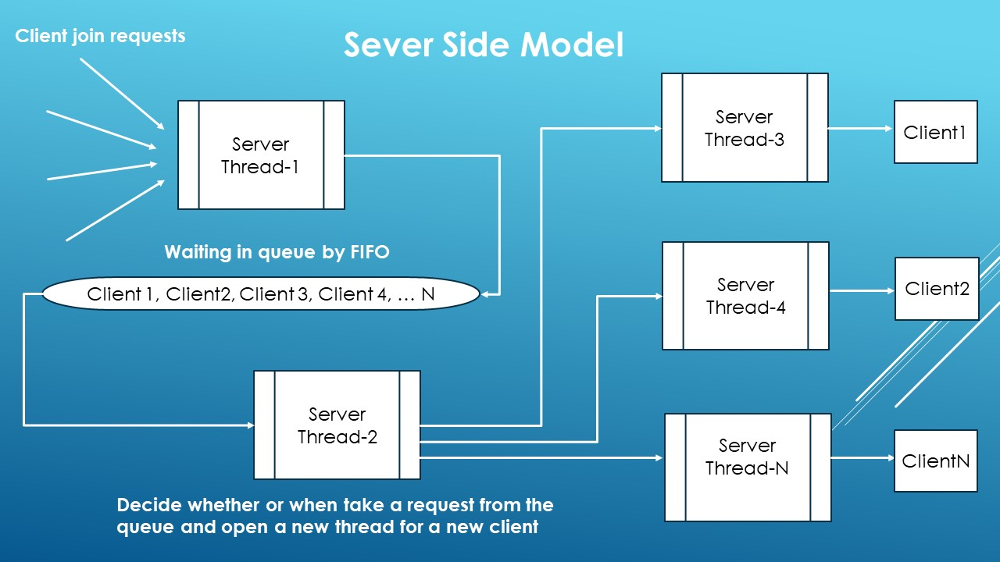
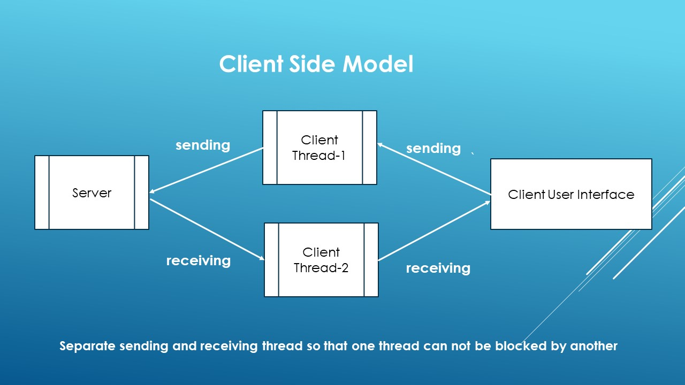
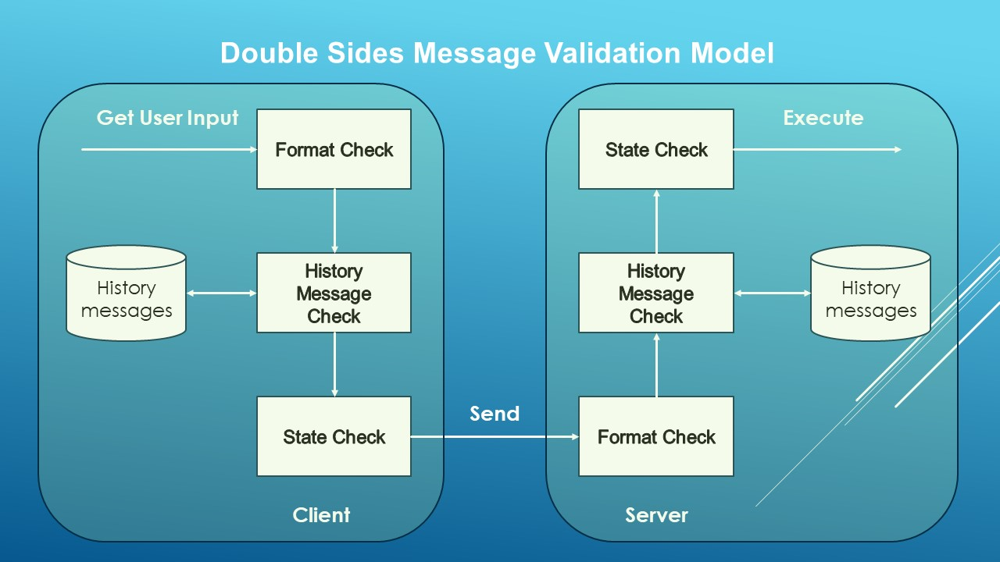
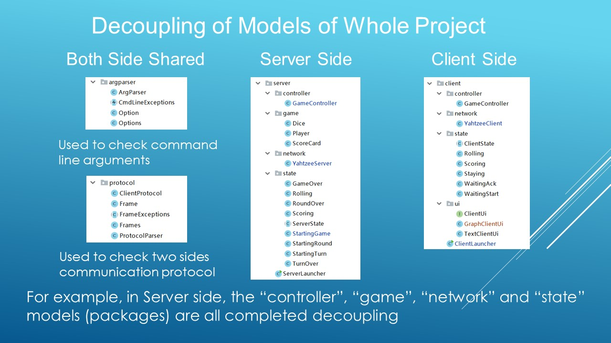
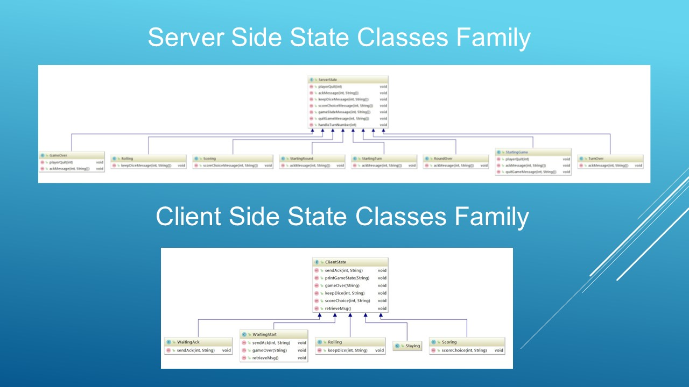
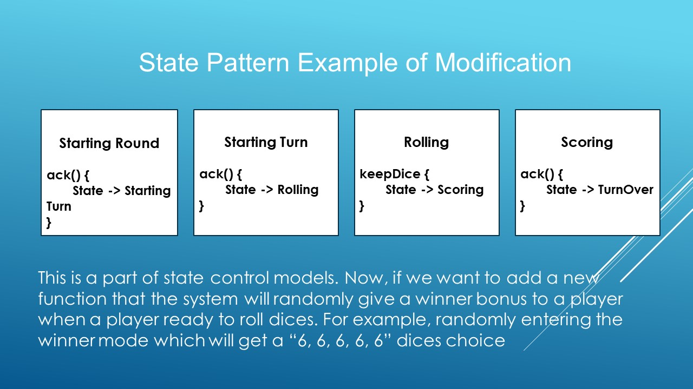
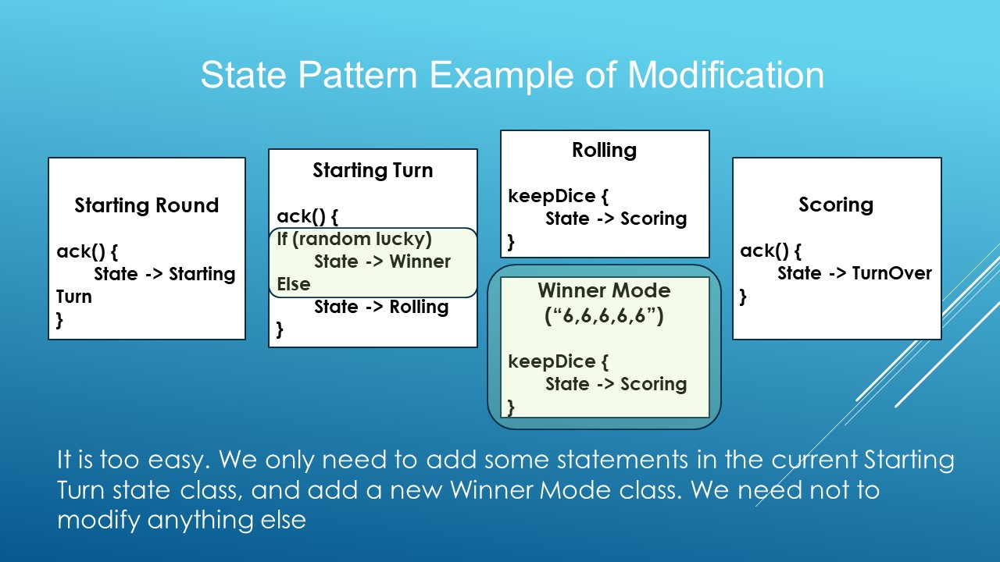
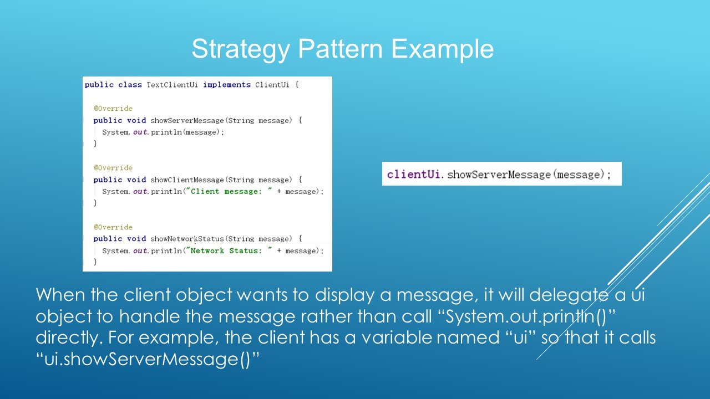
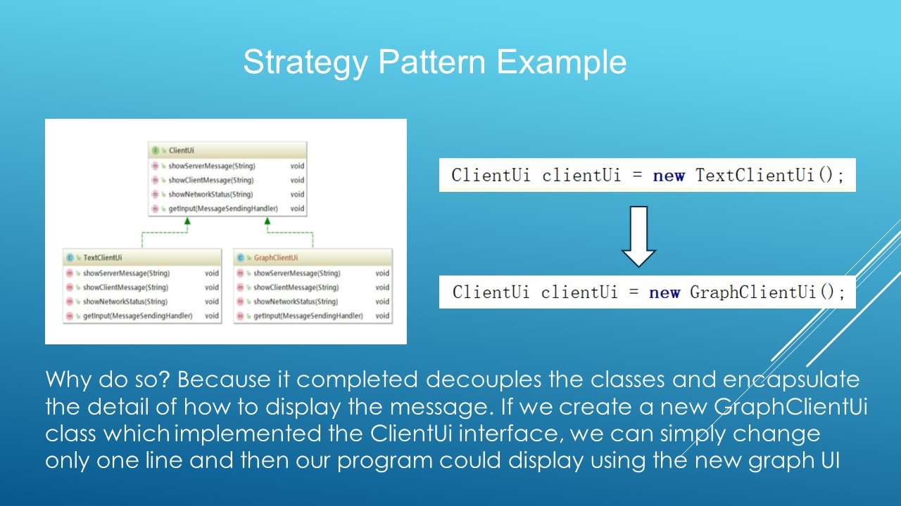

# Multiplayer-Yahtzee Key Features
+ Sever Side Model

+ Client Side Model

+ Double Sides Message Validation Model

+ Decoupling of Models of Whole Project

+ State Pattern

+ State Pattern Example of Modification

+ Strategy Pattern Example

